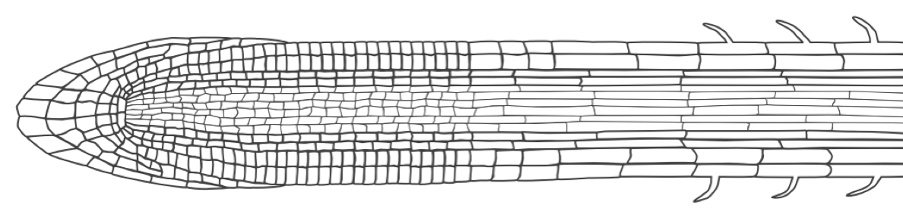

<!-- 
$size: 16:9
page_number: true
footer: Guillaume Lobet || LBRAI2219 || Soil-root-interactions
-->

# Introduction

Guillaume Lobet
**Soil-root interactions** - LRAI2219

	The introduction is based on a Teaching Tool 
    written by Larry York and Guillaume Lobet

---
# Course overview

---

# Single root anatomy

> [Bouché, Frédéric (2017) figshare](https://doi.org/10.6084/m9.figshare.4688809.v1)
